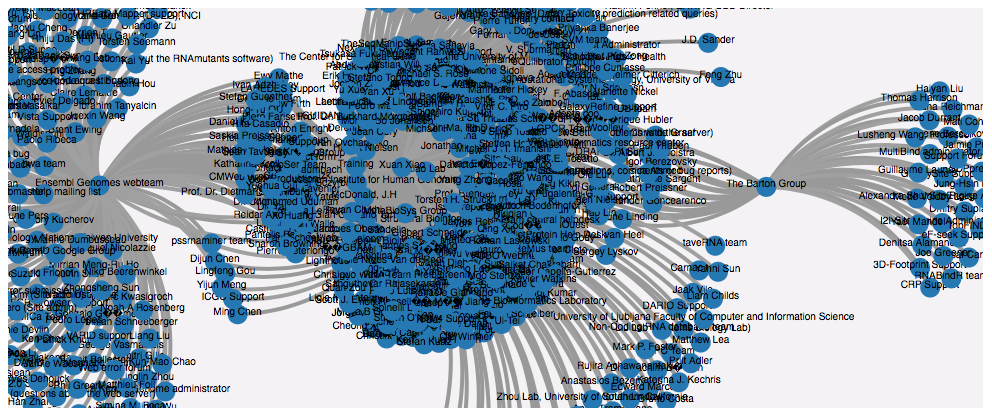

# bioagentsRdf
RDF data and SPARQL queries for producing/consuming Bio.Agents as Linked Data. RDF datasets have been produced through the [bioagentsShim/json2rdf](https://github.com/bio-agents/bioagentsShim/tree/master/json2rdf) agent. 

## Sample SPARL query
Here is a sample query run on this dataset. It connects persons with "share the same interest" relation when the agents they are associated to are annoated with the same EDAM topic.

```
CONSTRUCT {
    ?a1 <share_same_interests_with> ?a2
}  WHERE {
    ?s1 a <https://bio.agents/ontology/Resource>
    ?s1 <http://purl.org/dc/terms/publisher> ?a1
    ?s1 <http://edamontology.org/has_topic> ?t1

    ?s2 a <https://bio.agents/ontology/Resource>
    ?s2 <http://purl.org/dc/terms/publisher> ?a2
    ?s2 <http://edamontology.org/has_topic> ?t1
} LIMIT 2000
```

It results in the following graph: 

