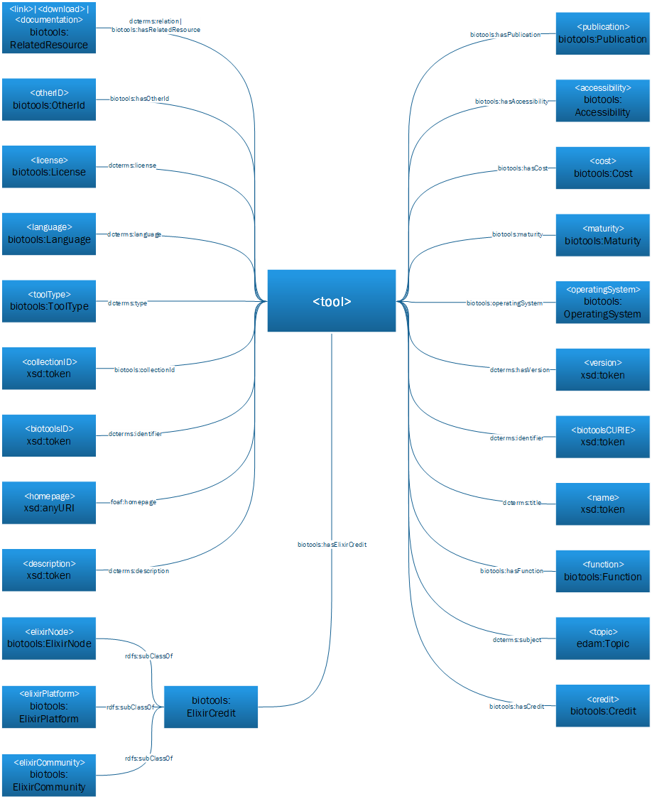
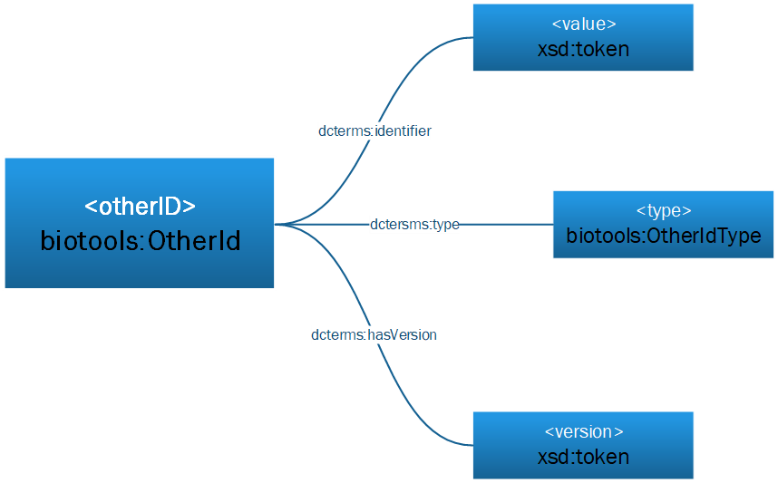
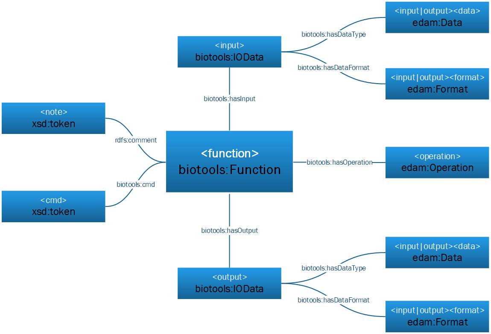
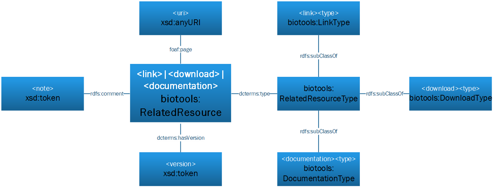
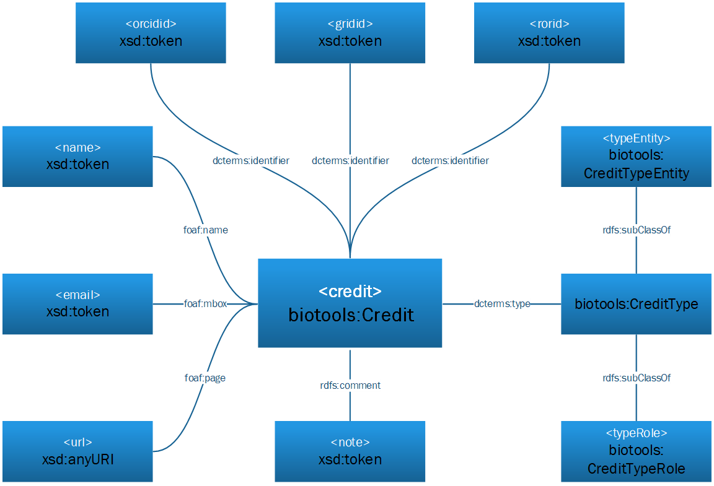
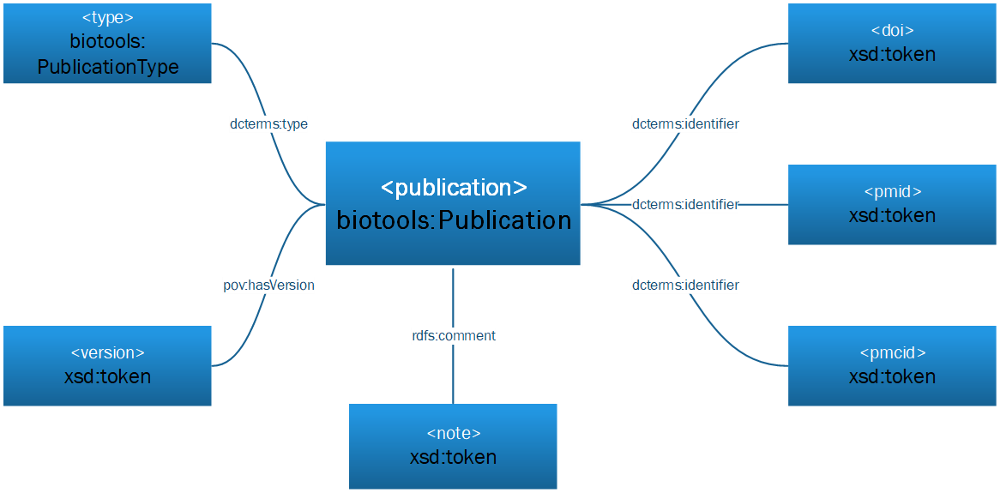

# Introduction

**CAUTION: bioagentsRDF is under construction; please contribute via the [tracker](https://github.com/bio-agents/bioagentsRdf/issues).  New classes and properies are yet to be formally defined.  Refer to [bioagentsSchema](http://github.com/bio-agents/bioagentsschema) and the [EDAM ontology](https://github.com/edamontology/edamontology/) upon which much of bioagentsRDF is based.**

The bioagents ontology (bioagentsRDF) defines the OWL2 Web Ontology Language encoding of [bioagentsSchema](https://github.com/bio-agents/bioagentsschema); the resource description model for bioinformatics software.  This document describes the set of classes, properties and restrictions that can be used to represent and interchange information about software provided in different systems and contexts.

bioagentsRDF is fully compatible with bioagentsSchema and thus [bio.agents](https://github.com/bio-agents/bioagentsregistry/); the registry of bioinformatics software resources (https//:bio.agents) provided by [IECHOR](https://www.iechor-europe.org/).

bioagentsRDF is an *application ontology* and re-uses other well established vocabularies wherever possible, adhering to the [MIREOT guidelines](http://precedings.nature.com/documents/3574/version/1) for concept imports.

# Namespaces
bioagentsRDF uses classes and properties from the following vocabularies:

prefix   | namespace IRI                               | definition
-------- | ------------------------------------------- | ----------
xsd      | http://www.w3.org/2000/10/XMLSchema#        | [XML Schema Namespace](https://www.w3.org/TR/2012/REC-xmlschema11-2-20120405/)
rdfs     | http://www.w3.org/2000/01/rdf-schema#       | [RDF Schema 1.1 namespace](https://www.w3.org/TR/2014/REC-rdf-schema-20140225/)
dcterms  | http://purl.org/dc/terms/                   | [DCMI terms namespace](http://dublincore.org/documents/dcmi-terms/) of Dublin Core Metadata Initiative
foaf     | http://xmlns.com/foaf/0.1/#                 | [FOAF namespace](http://xmlns.com/foaf/spec/)
edam     | http://edamontology.org#                    | [EDAM namespace](https://github.com/edamontology/edamontology)


The following vocabularies are used for housekeeping (internal aspects of bioagentsRDF not documented below):

prefix   | namespace IRI                                 | definition
-------- | --------------------------------------------- | ----------
rdf      | http://www.w3.org/1999/02/22-rdf-syntax-ns#   | [RDF namespace](https://www.w3.org/TR/rdf-schema/)
dc       | http://purl.org/dc/elements/1.1/              | [Dublin Core Metadata Element Set](http://dublincore.org/documents/dces/), Version 1.1 (original 15 elements)
owl      | http://www.w3.org/2002/07/owl#                | [OWL Web Ontology Language](https://www.w3.org/TR/owl-guide/)
doap     | http://usefulinc.com/ns/doap#                 | [DOAP vocabulary](https://github.com/ewilderj/doap/wiki)
oboInOwl | http://www.geneontology.org/formats/oboInOwl# | [oboInOwl vocabulary](https://www.bioontology.org/wiki/OboInOwl:Main_Page)
obo      | http://purl.obolibrary.org/obo/               | [OBO vocabulary](https://owlcollab.github.io/oboformat/doc/obo-syntax.html)


     
# Classes
bioagentsRDF uses the following classes:

class                        | description                     | bioagentsSchema
---------------------------- | ------------------------        | --------------
bioagents:Agent                | Bioinformatics software         | ```<agent>```
bioagents:AgentType            | Type of software                | ```<agentType>```
bioagents:Accessibility       | Software accessibility          | ```<accessibility>```
bioagents:OperatingSystem     | Supported operating system      | ```<operatingSystem>```
bioagents:Language            | Programming language            | ```<language>```
bioagents:License             | Software or data usage license  | ```<license>```
bioagents:Maturity            | Software development stage      | ```<maturity>```
bioagents:OtherId             | Software unique identifier      | ```<otherID>```
bioagents:OtherIdType         | Type of software identifier     | ```<otherID><type>```
bioagents:Function            | Software function / mode        | ```<function>```
bioagents:IOData              | Input or output data            | ```<function><input>\|<output>```
edam:Data                    | Type of data                    | ```<function><input>\|<output><data>```
edam:Format                  | Format of data                  | ```<function><input>\|<output><format>```
edam:Operation               | Basic operation / method        | ```<function><operation>```
bioagents:RelatedResource     | Link, download or documentation | ```<link>\|<download>\|<documentation>```
bioagents:RelatedResourceType | Type of related resource        | *see below*
bioagents:Credit              | Credit of the software          | ```<credit>```
bioagents:CreditType          | Type of credit                  | *see below*
bioagents:iEchorCredit        | IECHOR credit                   | *see below*
bioagents:Publication         | Publication about the software  | ```<publication>```
bioagents:PublicationType     | Type of publication             | ```<publication><type>```
xsd:token                    | String (with restrictions)      | - 
xsd:anyURI                   | URI                             | - 


NB:  bioagents:Agent is equivalent to the Software class (http://purl.org/dc/dcmitype/Software) from the [DCMI Type Vocabulary](http://dublincore.org/documents/dcmi-type-vocabulary/).

## Subclasses of bioagents:RelatedResourceType

class                        | description           | bioagentsSchema
---------------------------- | --------------------- | --------------
bioagents:LinkType            | Type of link          | ```<link><type>```
bioagents:DownloadType        | Type of download      | ```<download><type>```
bioagents:DocumentationType   | Type of documentation | ```<documentation><type>```


## Subclasses of bioagents:CreditType

class                        | description             | bioagentsSchema
---------------------------- | ----------------------- | --------------
bioagents:CreditTypeEntity    | Type of credited entity | ```<credit><typeEntity>```
bioagents:CreditTypeRole      | Role of credited entity | ```<credit><typeRole>```

## Subclasses of bioagents:iEchorCredit

class                        | description               | bioagentsSchema
---------------------------- | ------------------------- | --------------
bioagents:iEchorNode          | IECHOR national node      | ```<iechorNode>```
bioagents:iEchorPlatform      | IECHOR technical platform | ```<iechorPlatform>```
bioagents:iEchorCommunity     | IECHOR community          | ```<iechorCommunity>```


# Properties
bioagentsRDF uses the following properties:

property                    | note
---------------------       | --------------   
bioagents:hasAccessibility   | Agent has an accessibility tag
bioagents:collectionId       | Agent has assignment to some collection in bio.agents
bioagents:hasCost            | Agent has a monetary cost
bioagents:hasiEchorCredit    | Agent has a credited IECHOR entity
bioagents:hasFunction        | Agent has a function/mode of operating
bioagents:hasInput           | Agent function/mode has an input
bioagents:hasOperation       | Agent function/mode performs some specific operation 
bioagents:hasOtherId         | Agent has an identifier (typically in addition to bio.agents agentID)
bioagents:hasOutput          | Agent function/mode has an output
bioagents:hasRelatedResource | Agent has a related resource (link, download or documentation)
bioagents:hasMaturity        | Agent has associated product maturity level
bioagents:hasOperatingSystem | Agent has supported operating system
bioagents:cmd                | Agent function/mode has pertinent command-line fragment
bioagents:hasDataType        | Input or output is of a certain data type
bioagents:hasDataFormat      | Input or output supported in a certain data format
dcterms:description         | Agent has a textual description
dcterms:identifier          | Misc entity has an identifier
dcterms:language            | Agent has a relevant programming languages(s)
dcterms:license             | Agent has a software or data usage license
dcterms:subject             | Agent has a relevant EDAM topic
dcterms:title               | Agent has a name
dcterms:type                | Misc entity has tags from controlled vocabulary
foaf:name                   | Credited entity has a name
foaf:mbox                   | Credited entity has an email address
foaf:page                   | Misc. entity has a URL
dcterms:hasVersion          | Misc. entity has associated version information
rdfs:comment                | Misc. entity has an associated note


# Data model

## bioagents:Agent




property                        | value                     | bioagentsSchema
---------------------           | --------------            | ---------------------
dcterms:title (1)               | xsd:token                 | ```<name>```
dcterms:description             | xsd:token                 | ```<description>```
foaf:page                       | xsd:anyURI                | ```<homepage>```
dcterms:identifier              | xsd:token                 | ```<bioagentsID>```
dcterms:identifier              | xsd:token                 | ```<bioagentsCURIE>```
dcterms:hasVersion              | xsd:token                 | ```<version>```
dcterms:type                    | bioagents:AgentType         | ```<agentType>```
dcterms:subject (2)             | edam:Topic                | ```<topic>```
bioagents:hasOperatingSystem     | bioagents:OperatingSystem  | ```<operatingSystem>```
dcterms:language                | bioagents:Language         | ```<language>```
dcterms:license                 | bioagents:License          | ```<license>```
bioagents:collectionId           | xsd:token                 | ```<collectionID>```
bioagents:hasMaturity            | bioagents:Maturity         | ```<maturity>```
bioagents:hasCost                | bioagents:Cost             | ```<cost>```
bioagents:hasAccessibility       | bioagents:Accessibility    | ```<accessibility>```
bioagents:hasiEchorCredit        | bioagents:iEchorCredit     | ```<iechorNode>\|<iechorPlatform>\|<iechorCommunity>```
bioagents:hasOtherId             | bioagents:OtherId          | ```<otherID>```
bioagents:hasFunction            | bioagents:Function         | ```<function>```
bioagents:hasRelatedResource (3) | bioagents:RelatedResource  | ```<link>\|<download>\|<documentation>```


(1) foaf:name also applicable
(2) foaf:topic also applicable
(3) dcterms:relation also applicable?


## bioagents:OtherId



property                     | value                        | bioagentsSchema
---------------------------- | --------------               | ---------------------
dcterms:identifier           | xsd:token                    | ```<otherid><value>```
dcterms:type                 | bioagents:OtherIdType         | ```<otherid<type>```
dcterms:hasVersion           | xsd:token                    | ```<otherid><version>```


## bioagents:Function




property              | value           | bioagentsSchema
--------------------- | --------------- | ---------------------
bioagents:hasInput     | bioagents:IOData | ```<function><input>```
bioagents:hasOperation | edam:Operation  | ```<function><operation>```
bioagents:hasOutput    | bioagents:IOData | ```<function><output>```
bioagents:cmd          | xsd:token       | ```<function><cmd>```
rdfs:comment          | xsd:token       | ```<function><note>```

## bioagents:IOData

property               | value       | bioagentsSchema
---------------------- | ----------- | ----------------------------------
bioagents:hasDataType   | edam:Data   | ```<function><input>\|<output><Data>```
bioagents:hasDataFormat | edam:Format | ```<function><input>\|<output><Format>```


## bioagents:RelatedResource



property                     | value                        | bioagentsSchema
---------------------------- | --------------               | ---------------------
foaf:page                    | xsd:anyURI                   | ```<link>\|<download>\|<documentation><uri>```
rdfs:comment                 | xsd:token                    | ```<link>\|<download>\|<documentation><note>```
dcterms:hasVersion           | xsd:token                    | ```<link>\|<download>\|<documentation><version>```
dcterms:type                 | bioagents:RelatedResourceType | ```<link>\|<download>\|<documentation><type>```


## bioagents:Credit



property                     | value                        | bioagentsSchema
---------------------------- | --------------               | ---------------------
foaf:name                    | xsd:token                    | ```<credit><name>```
foaf:mbox                    | xsd:token                    | ```<credit><email>```
foaf:page                    | xsd:anyURI                   | ```<credit><url>```
dcterms:identifier           | xsd:token                    | ```<credit><orcidid>```
dcterms:identifier           | xsd:token                    | ```<credit><gridid>```
dcterms:identifier           | xsd:token                    | ```<credit><rorid>```
dcterms:identifier           | xsd:token                    | ```<credit><fundrefid>```
rdfs:comment                 | xsd:token                    | ```<credit><note>```
dcterms:type                 | bioagents:CreditType          | ```<credit><typeEntity>\|<typeRole>```


## bioagents:Publication



property                     | value                        | bioagentsSchema
---------------------------- | --------------               | ---------------------
dcterms:identifier           | xsd:token                    | ```<publication><doi>```
dcterms:identifier           | xsd:token                    | ```<publication><pmid>```
dcterms:identifier           | xsd:token                    | ```<publication><pmcid>```
dcterms:type                 | bioagents:PublicationType     | ```<publication><type>```
dcterms:hasVersion           | xsd:token                    | ```<publication><version>```
rdfs:comment                 | xsd:token                    | ```<publication><note>```


